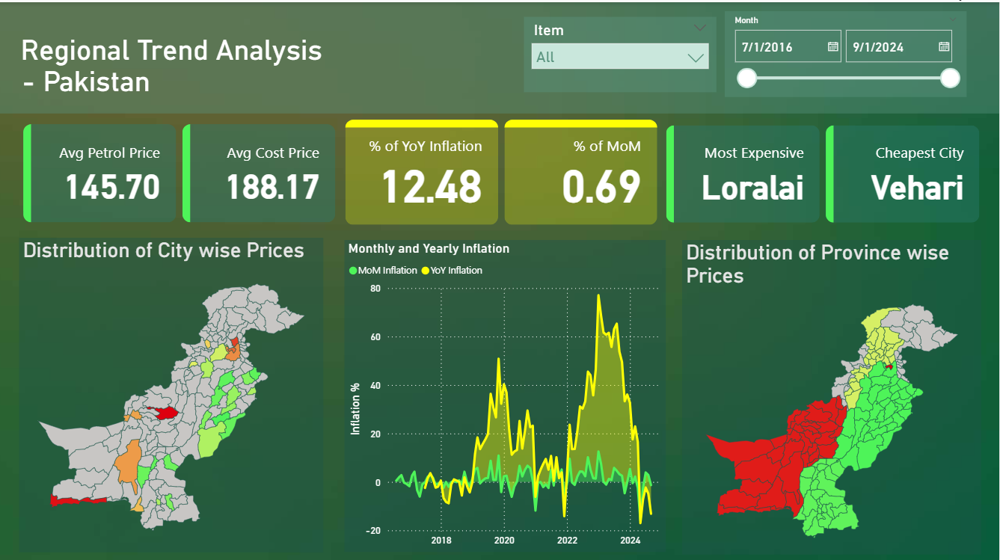

# 📊 From Data to Impact: CPI Dashboard Journey!

<p align="center">
  
</p>

<p align="center">
  <a href="https://syedzeerak.github.io/index.html" target="_blank">
    
  </a>
  &nbsp;
  <a href="CPI_Dashboard.pbix" target="_blank">
    
  </a>
  &nbsp;
  <a href="https://www.kaggle.com/datasets/zincly/pakistan-consumer-price-index-cpi-data-2016-24" target="_blank">
    
  </a>
</p>

---

## 🏆 Background

In **October 2024**, I had the opportunity to present this **Consumer Price Index (CPI) Analysis Dashboard** at the **first-ever Data Fest Pakistan**, organized by the **Pakistan Bureau of Statistics (PBS)**.

Against some of the best data-driven projects in the country, this dashboard was awarded:
✨ **Winner – Data Project Exhibition 2024** 🎉

This project goes beyond visualization—it’s about using data for **policy impact** and **real-world decision-making**.

---

## ✅ Dashboard Features

<details open>
<summary><b>Customizable Insights</b></summary>

* Select specific **commodities**, **cities**, and **time periods**
* Dynamic drilldowns for focused analysis

</details>

<details>
<summary><b>Regional Heatmaps</b></summary>

* Visualize inflation trends across **Pakistan’s provinces & cities**
* Compare regional price disparities with clarity

</details>

<details>
<summary><b>Forecasting Models</b></summary>

* Predict **CPI and fuel price trends up to 2025**
* Leverages Power BI’s forecasting & analytics functions

</details>

<details>
<summary><b>Policy Insights</b></summary>

* Designed to support **data-driven policymaking**
* Helps decision-makers **understand inflation drivers** and regional disparities

</details>

---

## 📊 Key Visuals

* 📈 **Inflation Trends Over Time** (national & city-level)
* 🗺️ **Geographic Heatmaps** (regional disparities)
* 🛢️ **Fuel Price Correlations** with CPI
* 🔮 **Forecasting Dashboards** (future projections)

---

## 🌍 Real-World Impact

This project was designed as a **bridge between data & policy**:

* Helping **economists** interpret inflation data.
* Supporting **policymakers** in creating strategies.
* Empowering **citizens** with transparent insights.

---

## 🧱 Repo Structure

```
.
├── CPI_DASH.pbix              # Power BI report
│   cpi-dashboard-preview.png   # Dashboard screenshot
└── README.md
```

---

## 🔗 Resources

* 📊 **Live Dashboard:** [Explore Here](https://syedzeerak.github.io/index.html)
* 📂 **Dataset:** [Kaggle – CPI Pakistan 2024](https://www.kaggle.com/datasets/zincly/pakistan-consumer-price-index-cpi-data-2016-24)
* 🖥️ **PBIX File:** [Download](CPI_DASH.pbix)

---

## 📢 Connect

<p align="center">
  <a href="https://www.linkedin.com/in/syed_wajdan_zeerak" target="_blank">
    
  </a>
  &nbsp;
  <a href="https://www.kaggle.com/zincly" target="_blank">
    
  </a>
</p>

---

## 🏷️ Tags

`#PowerBI` `#CPIAnalysis` `#Pakistan` `#PBS` `#DataFestPakistan` `#BusinessIntelligence` `#PolicyMaking` `#DataVisualization`

---

💡 *This dashboard is not just visuals—it’s an attempt to show how **data science can shape real-world policy decisions.*** 🌍📈

---

Would you like me to also craft a **short GitHub repo description (1-liner)** like we did for your Job Market repo, so it looks clean in search results?
